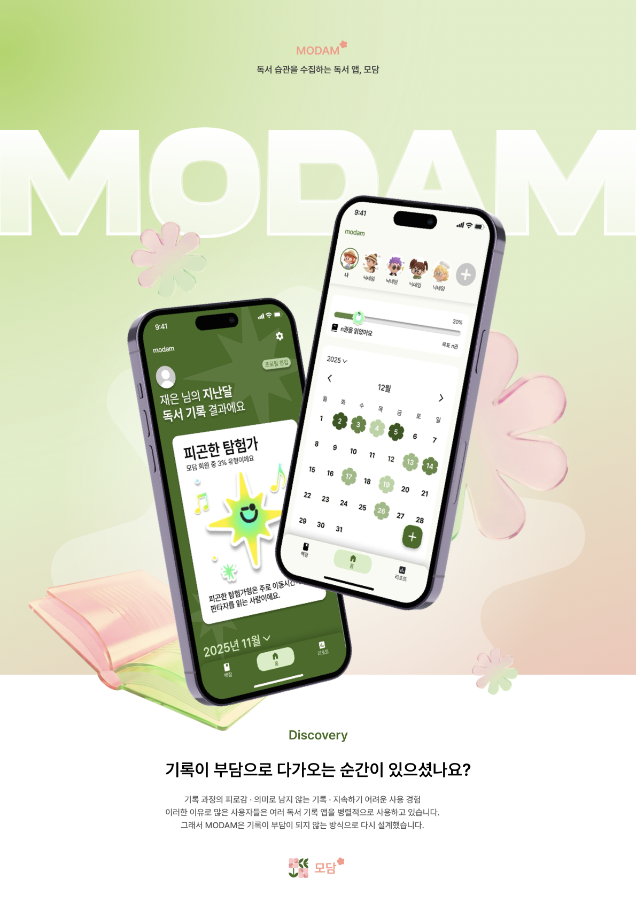

<h1 align="center">🌱 Modam</h1>

  <strong>기록을 모아 나를 담다</strong>

 

  Modam은 일상의 기록을 통해 
  사용자의 독서 습관과 취향을 시각화하고, 
  나만의 리듬을 발견하도록 돕는 기록 중심 서비스입니다.

  

 
 

<h2 align="center">🗓 Project Duration</h2>

  <strong>🚀 MVP</strong> 
  2025.10.11 - 2025.12.27

 

  <strong>🧪 Alpha & Beta Test</strong> 
  2025.12.27 - ing

 
 

<h2 align="center">👩‍👩‍👧‍👦 Team</h2>

| 박재은 | 유지원 | 이세은 | 김소연 | 손상준 | 박보연 | 황규민 |
| --- | --- | --- | --- | --- | --- | --- |
|  PM |  DE |  DE |  FE |  FE |  BE |  BE |

  

